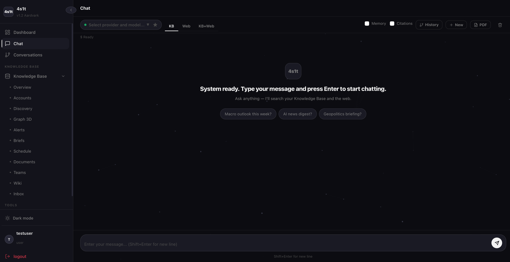

# 4S1T Agent AI

**Version: v1.2.0** · Python 3.9+ · Docker · MIT License

A self-hosted, privacy-first AI agent with multi-agent orchestration, a continuously updated Knowledge Base, and 45 built-in tools covering research, data analysis, business analysis, visualisation, and more. Send it any task — it decomposes the work across specialist agents, executes skills (web search, Python, BABOK analysis, chart generation…), and delivers results to your browser and your phone over end-to-end encrypted Nostr DMs.

It also runs a background **Knowledge Base**: a continuously updated intelligence feed from sources you configure, with contradiction detection, semantic alerts, and automated daily briefs delivered over Nostr.

---



---

> **Please Read Before Use**
>
> This project started as AI-assisted ("vibe") coding and has since been brought under **Specification-Driven Development (SDD)** — an internal discipline enforced through domain specs, agent specs, and session records in `sdd/`, requiring spec-before-code on all domain changes. Every session is reviewed and directed by a human — AI assists but does not operate autonomously.
>
> The code architecture follows **Domain-Driven Design (DDD)** principles: bounded contexts, ports and adapters, domain events, and aggregates — separating domain logic from infrastructure concerns.
>
> Neither approach substitutes for a security audit. The system has **not been audited by a security professional**.
>
> If you intend to deploy in any environment where security matters — internet exposure, sensitive data, or production context — **evaluate the risks yourself and perform your own security review.** Use at your own risk.

---

## What It Does

**On-demand tasks:**

1. Checks task complexity — simple queries route directly to the synthesis agent; complex tasks are decomposed into a parallel work graph
2. Assigns subtasks to specialist agents and runs waves concurrently
3. Scrubs PII from every prompt before it leaves your machine
4. Routes all AI API calls through Tor to prevent provider fingerprinting
5. Returns the result in the browser and as an encrypted Nostr DM to your phone

**Background Knowledge Base:**

1. Ingests content hourly from accounts you follow (social feeds, YouTube, podcasts, websites, Nostr relays, Rumble)
2. Embeds, deduplicates, and indexes chunks into ChromaDB
3. Detects contradicting claims across different sources
4. Fires semantic alerts when new content matches subscribed topics
5. Generates daily intelligence briefs per domain and delivers them via Nostr DM

---

## Architecture

```
  You (browser / Nostr client / API)
          │
          ▼
  ┌───────────────────┐
  │   Web UI / API    │  FastAPI on :8000
  └────────┬──────────┘
           │
           ▼
  ┌───────────────────┐       ┌─────────────────────────────┐
  │  OrchestratorAgent│──────►│  Worker Agents               │
  │  (task graph,     │       │  data / research / synthesis │
  │   wave scheduler) │       │  / domain experts (from YAML)│
  └────────┬──────────┘       └──────────┬──────────────────┘
           │                             │ skills
           │                  ┌──────────▼──────────────┐
           │                  │  Executor Service        │  :8001 internal
           │                  │  (air-gapped Docker)     │  network_mode: none
           │                  └─────────────────────────┘
           │
           ▼
  ┌───────────────────┐
  │  Privacy Layer    │  PII scrub → Tor → AI provider
  └────────┬──────────┘
           ▼
  ┌───────────────────┐
  │  Nostr NIP-17     │  Encrypted DMs to your mobile client
  └───────────────────┘

  ┌──────────────────────────────────────────────────┐  (background)
  │  KBScheduler                                     │
  │  Ingest → Embed → Dedup → Alerts → Brief → NIP-17│
  └──────────────────────────────────────────────────┘
```

---

## Agents

Four built-in framework agents, plus a dynamic domain expert layer:

| Agent | Role | Key skills | Approval gate |
|---|---|---|---|
| `data_agent` | Python data analysis and visualisation | `python_execute`, `data_read`, `chart_generate`, `export_results` | `python_execute` |
| `research_agent` | Web and KB research; reminder management | `web_search`, `web_scrape`, `knowledge_base_search`, `manage_task` | — |
| `synthesis_agent` | Reasoning, writing, direct assistant | `web_search`, `knowledge_base_search` | — |
| `kb_monitor_agent` | Generate and save daily KB briefs (scheduler only) | `knowledge_base_search`, `file_write` | — |

**Domain expert agents** are loaded at startup from `src/config/kb_domains.yaml` — one specialist per domain you configure. The Business Analysis agent (`ba_agent`, CBAP/BABOK v3) is an example of this: it is defined entirely in config and registers automatically, with no Python changes required. Add your own domain experts the same way.

---

## Features

| Area | Capability |
|---|---|
| **Agent orchestration** | Task graph with parallel wave execution; complexity heuristic bypasses decomposition for simple queries; up to 20 tool-call steps per agent; inter-wave result compression |
| **Skills** | 45 built-in: web search/scrape, Python execution (sandboxed), data read, chart generation, export, BA/BABOK tools (stakeholder analysis, process model, gap analysis, requirements tracing, business case, decision model, KPI analysis…), KB search, knowledge graph query, diagram generation, vision analysis, reminder and task management |
| **Knowledge Base** | Hourly ingestion from Nitter/Twitter, YouTube, podcasts, websites, Nostr, Rumble; ChromaDB vector store (bge-m3, 1024-dim); semantic deduplication; contradiction detection across sources; L1→L2→L3 account discovery; semantic alert subscriptions; automated daily briefs |
| **MCP server** | Exposes the skill framework as Model Context Protocol endpoints (`/mcp/tools`, `/mcp/resources`); external MCP-compatible clients can call any skill via the protocol |
| **Privacy** | PII scrubbing (13 types: PESEL, NIP, IBAN, credit card, email, phone, passport, IP…); Tor routing for all outbound AI calls; per-agent system prompt variant selection to resist fingerprinting; header anonymisation |
| **Nostr NIP-17** | End-to-end encrypted DMs (GiftWrap / NIP-44 v2); multi-relay fanout with failover; HITL approval flow; live chat |
| **Multi-provider AI** | Nano-GPT, OpenRouter, OpenAI, local Ollama — switchable per user and per route |
| **Security** | Argon2 passwords; JWT + optional TOTP/2FA; CSRF tokens; DLP whitelist; append-only audit log; RBAC |
| **Web UI** | Light/Dark theme; real-time chat with markdown; knowledge graph (3D); conversation linking; model selector; full KB management dashboard |
| **Language** | English and Polish |

---

## Knowledge Base

The KB runs independently of the chat interface and builds a domain-scoped intelligence corpus from the sources you follow.

**Setup:**
1. Copy `src/config/kb_domains.yaml.example` → `kb_domains.yaml`
2. Define your domains and accounts (social handles, YouTube channels, podcast feeds, websites)
3. Run bootstrap (one-time PDF/document indexing): `docker compose exec agent python3 -m kb.bootstrap`
4. The scheduler takes over from there — no further intervention needed

**What runs automatically:**
- **Ingestion** (hourly): fetches new content, embeds it, deduplicates against existing chunks, checks for contradictions with other sources
- **Alerts**: notify you when ingested content matches a semantic query you subscribed to
- **Briefs** (daily, after 07:00 UTC): `kb_monitor_agent` generates one brief per domain from recent KB content, delivers it as a Nostr DM
- **Source discovery**: entity extraction from content surfaces new L2 candidate accounts for your review

See [docs/modules/knowledge_base.md](docs/modules/knowledge_base.md) for full schema, skill reference, and ingestion adapter details.

---

## Hardware Requirements

| | Minimum | Recommended |
|---|---|---|
| CPU | Core2Duo (SSE2) | Core i5 8th Gen+ |
| RAM | 4 GB | 16 GB |
| Storage | 200 GB HDD | 500 GB SSD |
| Network | Local LAN | LAN + Tor |

> `numpy` is pinned below 2.0 and `cryptography` uses pure-Python fallbacks — the system runs fully on hardware without SSE4.2 or AES-NI. KB ingestion is serialised (2-worker thread pool) to prevent OOM on memory-constrained hardware.

---

## Quick Start (Docker)

```bash
# 1. Clone
git clone https://github.com/4spacesvs1tab/4s1t_agentai.git
cd 4s1t_agentai

# 2. Configure
cp .env.example .env
# Edit .env — set SECRET_KEY, EXECUTOR_JWT_SECRET, ACTIVE_PROVIDER, and your API key

# 3. Configure Nostr
cp config/nostr_nip17.example.yaml config/nostr_nip17.yaml
# Edit: set recipient_pubkey to your npub

# 4. Build and start
docker compose up --build -d

# 5. Open
http://localhost:8000
```

See [QUICKSTART.md](QUICKSTART.md) for the fast-track including certificate generation.  
See [INSTALL.md](INSTALL.md) for the full walkthrough: Tor setup, Nostr key generation, KB bootstrap.

---

## Documentation

| Document | What it covers |
|---|---|
| [QUICKSTART.md](QUICKSTART.md) | Up and running in 5 steps |
| [INSTALL.md](INSTALL.md) | Full installation: Tor, Nostr relay, client setup, `.env` reference |
| [docs/architecture/agent_orchestration.md](docs/architecture/agent_orchestration.md) | Task graph, wave scheduling, agents, skills execution model, HITL approval |
| [docs/modules/knowledge_base.md](docs/modules/knowledge_base.md) | KB ingestion pipeline, vector search, briefs, alerts, source discovery, YAML schema |
| [docs/modules/nostr_nip17.md](docs/modules/nostr_nip17.md) | NIP-17 setup, relay config, approval flow, compatible clients |
| [docs/modules/privacy_layer.md](docs/modules/privacy_layer.md) | PII scrubbing, Tor routing, prompt obfuscation, threat model and limitations |

---

## External Dependencies

Required on the host before starting:

- **Docker + Docker Compose** — container runtime
- **Tor** — anonymous outbound routing (`tor` daemon, SOCKS5 on `127.0.0.1:9050`)
- **Nostr client** — to receive encrypted DMs (e.g. Keychat on mobile)
- **Redis** — session store and rate limiter (must be running on host; defaults to `redis://localhost:6379/0`)
- **Nostr relay** — five public relays pre-configured; self-hosted optional

See [INSTALL.md](INSTALL.md) for setup instructions for each.

---

## API Endpoints (summary)

| Method | Path | Description |
|---|---|---|
| `GET` | `/health` | Service health |
| `POST` | `/auth/register` | Create account |
| `POST` | `/auth/login` | Login, receive JWT |
| `POST` | `/api/agent/chat` | Send a task to the agent |
| `GET` | `/api/models` | List available AI models |
| `GET` | `/mcp/tools` | List MCP tools |

Full API reference at `/docs` (Swagger UI) when running with `DEBUG=true`.

---

## Release History

| Version | Highlights |
|---|---|
| v1.2.0 | Knowledge Base intelligence platform — multi-source ingestion, contradiction detection, semantic alerts, daily briefs; 45-skill framework; DDD-aligned architecture; registration fix; release privacy hardening |
| v1.0.0 | First public release — agent orchestration, NIP-17, privacy layer, skills framework, web UI, i18n |

---

## Contributing

Bug reports, feature requests, and pull requests are welcome.

- Report issues at [GitHub Issues](https://github.com/4spacesvs1tab/4s1t_agentai/issues)
- Follow existing code patterns and keep PRs focused
- All new skills must include `meta.json` with scope declarations

---

## License

MIT License — see [LICENSE](LICENSE) for details.
